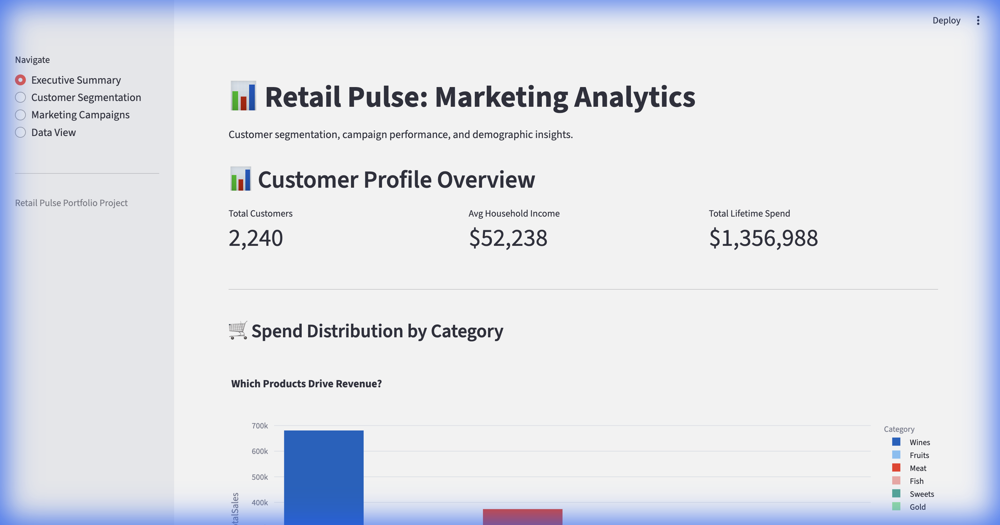
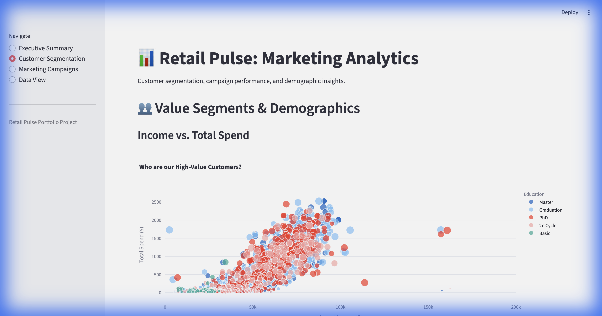
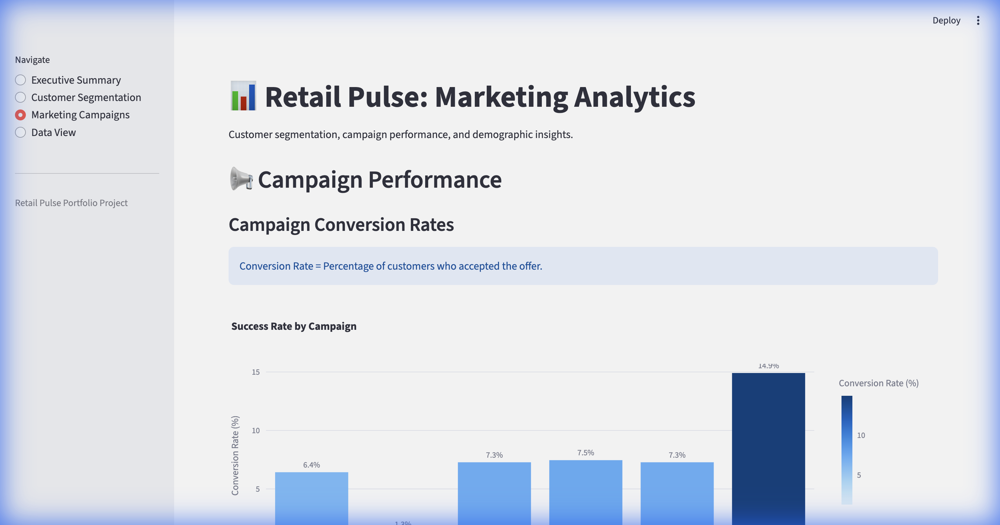
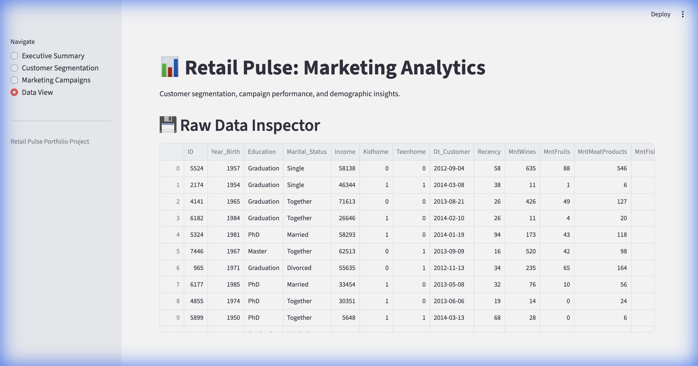

# 📊 Retail Pulse: Marketing Analytics Dashboard

A customer analytics project analyzing a marketing campaign dataset. Features customer segmentation (RFM analysis), demographic insights, and campaign performance tracking via an interactive Streamlit dashboard.

## Dashboard Screenshots

| Executive Summary | Customer Segmentation |
|:-----------------:|:---------------------:|
|  |  |

| Marketing Campaigns | Data View |
|:-------------------:|:---------:|
|  |  |

## 🚀 Features

- **Customer Segmentation**: RFM (Recency, Frequency, Monetary) analysis to identify high-value customers
- **Demographic Analysis**: Spend patterns by education level and marital status
- **Campaign Performance**: Conversion rate tracking across 6 marketing campaigns
- **Interactive Dashboard**: Built with Streamlit and Plotly for data exploration

## 🛠️ Tech Stack

- **Python 3.9+**
- **Pandas**: Data manipulation and cleaning
- **SQLite**: Data storage and SQL queries
- **Streamlit**: Interactive web dashboard
- **Plotly**: Visualizations

## 📂 Project Structure

```
RetailAnalyticsPortfolio/
├── src/
│   ├── app.py             # Streamlit Dashboard
│   ├── db_manager.py      # Data loading and ETL
│   └── verify_queries.py  # SQL query testing
├── sql/
│   ├── rfm_analysis.sql       # Customer segmentation
│   ├── demographics.sql       # Demographic insights
│   ├── campaign_performance.sql # Campaign metrics
│   └── kpi_sales.sql          # Sales KPIs
├── data/
│   └── retail_pulse.db    # SQLite Database
├── screenshots/
│   └── dashboard.png      # Dashboard preview
├── marketing_campaign.csv # Source dataset
└── requirements.txt
```

## 🏁 Getting Started

### 1. Install Dependencies

```bash
pip install -r requirements.txt
```

### 2. Load Data

```bash
python3 src/db_manager.py
```

### 3. Run Dashboard

```bash
streamlit run src/app.py
```


## 📈 Dataset

The project uses a marketing campaign dataset with 2,240 customers including:
- Demographics (income, education, marital status)
- Purchase history across 6 product categories
- Campaign response data (6 campaigns)
- Customer recency and purchase frequency

## 📊 Dashboard Pages

| Page | Description |
|------|-------------|
| **Executive Summary** | KPI metrics and spend by category |
| **Customer Segmentation** | Income vs spend analysis, RFM scatter plots |
| **Marketing Campaigns** | Conversion rates, responder profiles |
| **Data View** | Raw data inspector |
